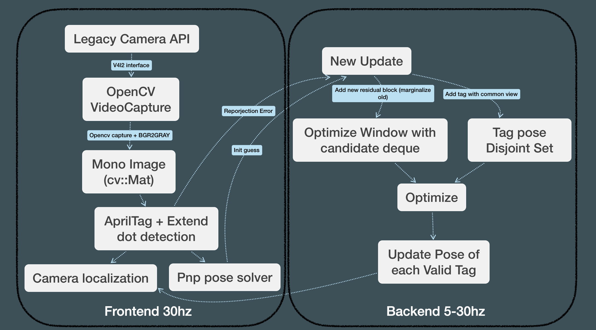

# apriltaglocal\_deploy

## Frame work





## Environment

### Hardware & OS

Raspberry pi 3, 3b, 3b+, 4, Zero 2W

Raspberry pi Os 32bit LTS With Lagency Camera API

### DLL Required

- AprilTag
- Yaml-cpp
- Glog
- Ceres
- Opencv4
- Eigen3

#### Install dll with `apt-get`

```shell
sudo apt install -y libyaml-cpp-dev libgoogle-glog-dev libeigen3-dev libceres-dev
sudo apt install -y libopencv-dev git cmake
mkdir 3rdparty && cd 3rdparty
git clone https://github.com/AprilRobotics/apriltag && cd apriltag
cmake -B build -DCMAKE_BUILD_TYPE=Release
sudo cmake --build build --target install
```

### Build Instruction (or direct run exe file with dll)

```shell
mkdir build && cd build
cmake ..
make
```

## How to run

`./localization`

or manually set config path by `./localization ${path_to_yaml_file}`

## Sample


## Trouble shooting

### Check whether camera is working

Camera Type We test v1 & v2 raspberry camera. But it should work with all camera which support Lagency Camera API on Raspberry Pi

* Plugin camera

* Open Lagency Camera interface with rasp `raspi-config`

* Reboot

* Install opencv python to run test script `sudo apt install -y python3-opencv`

* Using test script `cameratest.py` to test whether camera workwell

### Check whether the dll is working

Run the release exe file after doing  **Install dll with `apt-get`**

### Simulate Test with video

### Camera calibration

You need to calibrate the camera manually. Ros `camera calibration` maybe a good choice. 

You need to get  $f_x$  $f_y$  $c_x$ $c_y$ for intrinsic and  $k_1$  $k_2$  $p_1$  $p_2$ $(k_3)$  for distortion coefficients. Tipically you should not use camera with high distortion.

### Output check

See the Image out check whether everything goes well and check whether the xyz on the left top corner make sence unit is (m)
